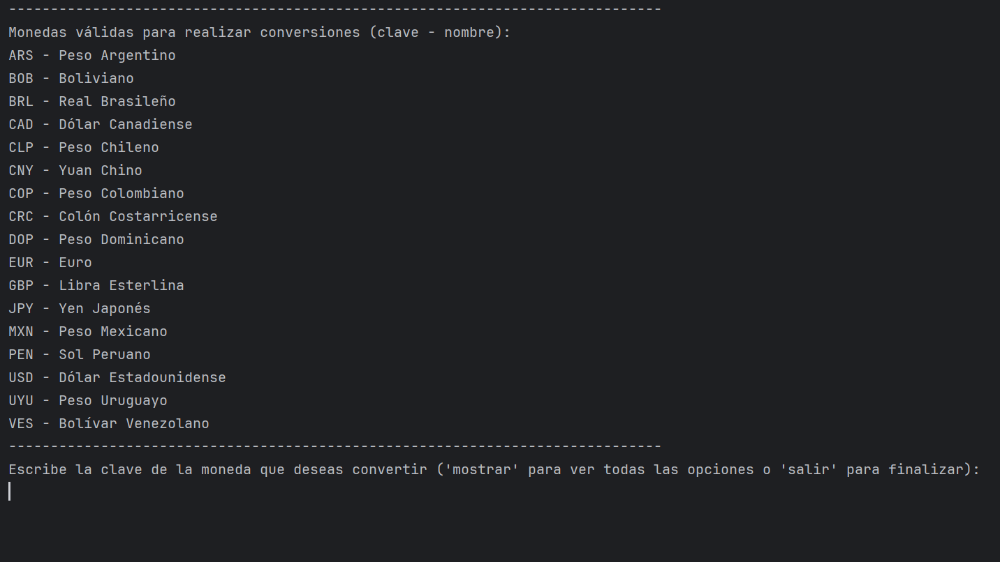
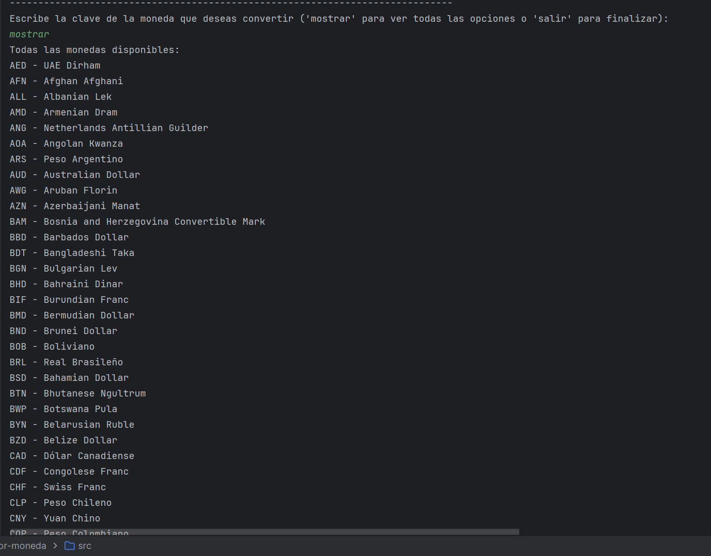
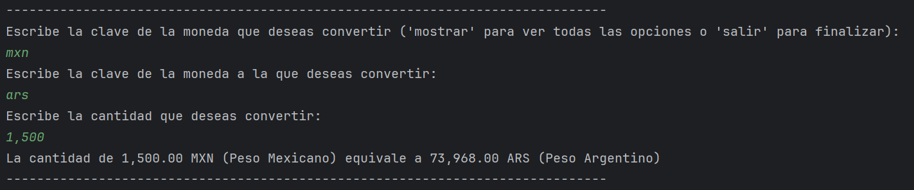
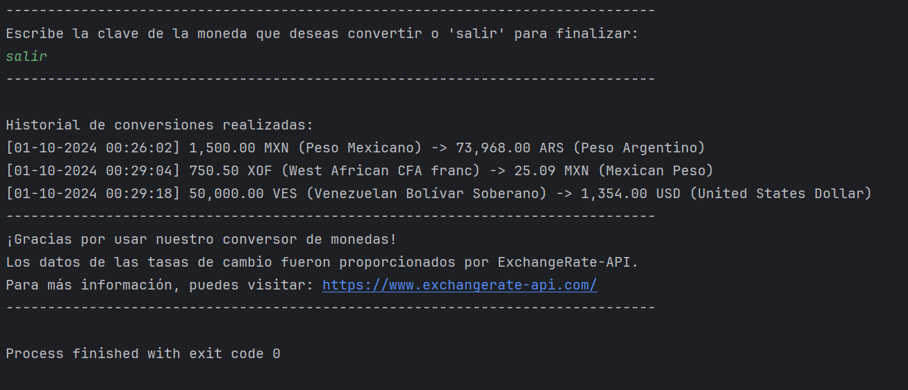

# Conversor de Moneda

## Descripción del Proyecto
Este es un **conversor de monedas** que obtiene datos en tiempo real mediante una API de tasas de cambio. El programa permite convertir entre diferentes monedas, mostrar los resultados en pantalla y guardar un historial de conversiones en un archivo JSON.

## Características
- Conversión en tiempo real entre diversas monedas.
- Interfaz de usuario sencilla y directa.
- Historial de conversiones almacenado en formato JSON.
- Funcionalidad para mostrar y guardar resultados.

## Uso
1. El usuario selecciona las monedas de origen y destino.
2. Se ingresa la cantidad a convertir.
3. El programa muestra los resultados en pantalla y guarda la transacción en el historial.

## Requisitos
- Java 17+
- Conexión a Internet para acceder a los datos de la API.

## Instalación
1. Clona este repositorio:
   ```bash
   git clone https://github.com/EduTriRo/conversor-moneda.git

## Menú Inicial



## Mostrar Resultados



## Respuesta



## Salir


